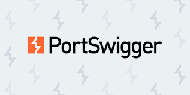

<!-- Name -->

	
	

<!-- =============================== -->

<!-- Job Title -->

	

 
<!-- =============================== -->

<!-- Profile Views -->

	
	

<!-- =============================== -->

<!-- Cover Image -->

	
	

<!-- =============================== -->

<!-- About me -->

	
	 About me 

 

- :school: I am a **`Student`** at [Faculty of Computers & AI](https://fci.sohag-univ.edu.eg/main/) at [Sohag University](https://www.sohag-univ.edu.eg/ar/).
- :computer: I am a **`CTF Player`** at [Portswigger](https://portswigger.net/), [Cybertalents](https://cybertalents.com/members/ak4m410x01/profile), [TryHackMe](https://tryhackme.com/p/3bdullahkama1).
- :computer: I am a **`Competitive Programmer`** at [ECPC](https://icpc.global/ICPCID/RYCWA1HDIYZ3), [Codeforces](https://codeforces.com/profile/3bdullahkama1), [Leetcode](https://leetcode.com/ak4m410x01), [HackerRank](https://www.hackerrank.com/ak4m410x01).
- :nerd_face: Always `learning new things`.
- :thinking: I’m currently open for a new `job opportunity`, this is [MY RESUME](./assets/doc/Abdullah_Kamal_Resume_05-2023.pdf).

 
<!-- =============================== -->

---

<!-- CTF Profiles -->

	
	 My CTF Profiles 

	&emsp;&emsp; 
	&emsp;&emsp; 
	     

 
<!-- =============================== -->

<!-- Competitive Programming Profiles -->

	
	 My Competitive Programming Profiles 

  &emsp;&emsp;&emsp; 
	
  &emsp;&emsp;&emsp; 
	
  &emsp;&emsp;&emsp; 
	
       

<!-- =============================== -->

<!-- Contact with me -->

	
	 Contact with me 

  &emsp;
	
  &emsp;
	
  &emsp;
	
  &emsp;
	
  

<!-- =============================== -->

<!-- Skills -->

	
	 My Skills 

<!-- Programming Languages -->

	
	 Programming Languages 

 
	
	&emsp;
	
	&emsp;
	
	&emsp;
	

<!-- ------------------------------------------ -->

<!-- Frontend Development -->

	
	 Frontend Development 

 
  &emsp;
  
  

<!-- ------------------------------------------ -->

<!-- Backend Development -->

	
	 Backend Development 

 
      
  &emsp;
   
  &emsp;
   

<!-- ------------------------------------------ -->

<!-- Database -->

	
	 Database 

 
  &emsp; 
     
  &emsp;
  
  &emsp;
  

<!-- ------------------------------------------ -->

<!-- Software & Tools -->

	
	 Software & Tools 

  &emsp;
    
  &emsp;
    
  &emsp;
    
  &emsp;
    
  &emsp;
    
  &emsp;
    
  &emsp;
    

<!-- ------------------------------------------ -->

<!-- IDEs -->

	
	 IDEs 

  &emsp;
    
  &emsp;
    
  &emsp;
    

<!-- ------------------------------------------ -->

<!-- Operating Systems -->

	
	 Operating Systems 

  &emsp;
    
  &emsp;
    
  &emsp;
    
  &emsp;
    
  &emsp;
    
  &emsp;
    
  &emsp;
    
  &emsp;
    
  &emsp;
    

 
<!-- ------------------------------------------ -->

---

	<a href="https://github.com/piyushsuthar/github-readme-quotes">
  

	
	 Github Stats 

  
<h3> 🔥 Streak Stats</h3>

---

<!-- --- -->

  
<h3>💻 GitHub Profile Stats</h3>

---

    
	  
 

<b>Note:</b> Top languages is only a metric of the languages my public code consists of and doesn't reflect experience or skill level.

  

<!-- --- -->

  
<h3>⚡ Recent GitHub Activity</h3>

---

 

<!-- --- -->

<!--

  
 <h3> :trophy: Git profile Trophies </h3>

---

 
	

-->

  

<!-- --- -->

<h2> 🐍 A Snake Eating my Contributions Graph </h2>

	

